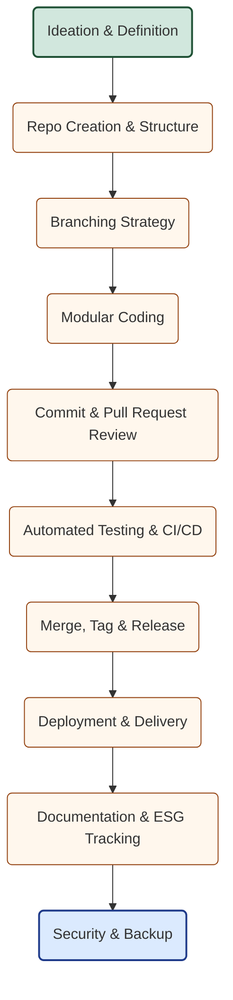

```mermaid
flowchart TD
  A(Ideation & Definition) --> B(Repo Creation & Structure)
  B --> C(Branching Strategy)
  C --> D(Modular Coding)
  D --> E(Commit & Pull Request Review)
  E --> F(Automated Testing & CI/CD)
  F --> G(Merge, Tag & Release)
  G --> H(Deployment & Delivery)
  H --> I(Documentation & ESG Tracking)
  I --> J(Security & Backup)
  style A fill:#d1e7dd,stroke:#1f5135,stroke-width:2px
  style J fill:#dbeafe,stroke:#1e3a8a,stroke-width:2px
  classDef process fill:#fff7ed,stroke:#92400e,stroke-width:1px;
  class B,C,D,E,F,G,H,I process;
```